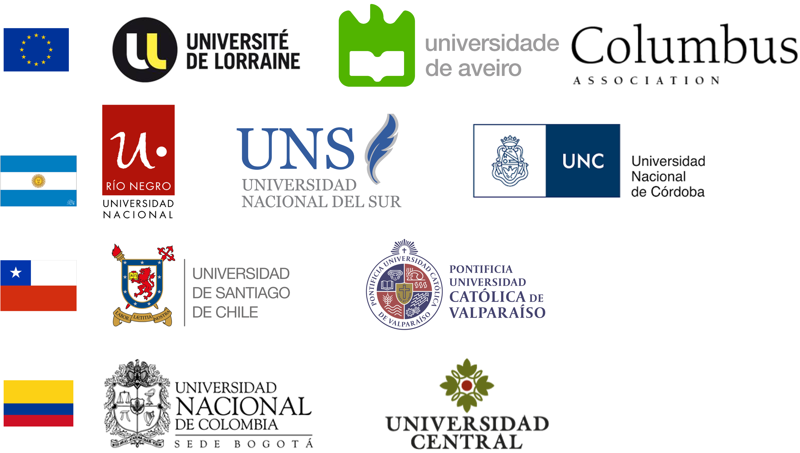
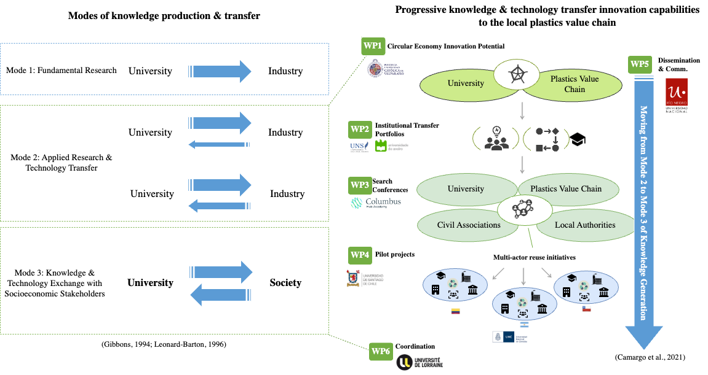
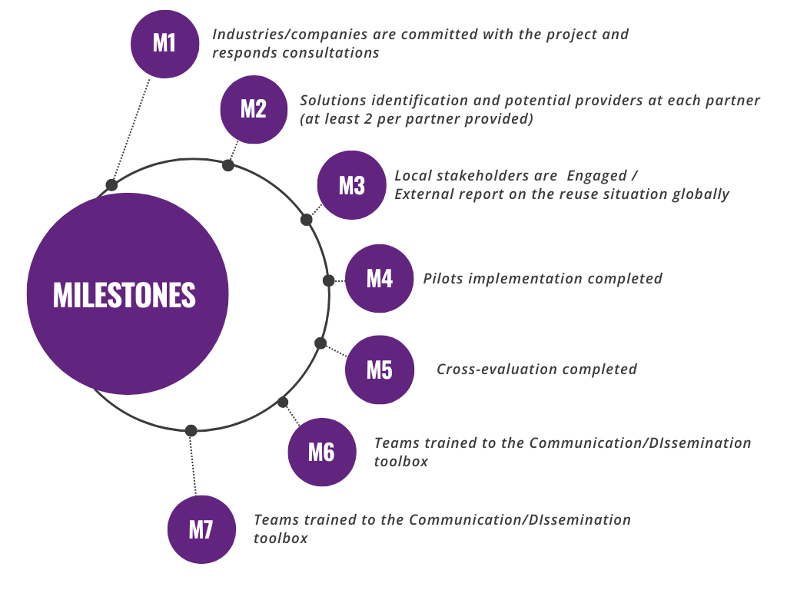

# TechTraPlastiCE Project {.tema-naranja .center}

## Consortium {.naranja background-image="figures/Consorcio.png" background-size="30%" background-position="90% 50%"}

🏛️ 9 Higher Education Institutions | 1 Association  
⏳ Feb. 2025 - Jan. 2028  
€ 799.887 Euros

## TechTraPlastiCE's Main Goal {background-image="bogota.jpeg" background-size="40%" background-position="100% 50%"}

:::{layout="[45, 30]"}

  
🎯 To **reinforce the applied research and technological transfer capacities of the universities** improving their services portfolios to strengthen the plastic industry's contribution to the green transition.
:::

## The TechTraPlastiCE's Ambition {background-image="chile.png" background-size="50%" background-position="0% 50%"}

:::{layout="[50, 50]"}

:::{}
:::

:::{}

To foster the **collaboration and partnerships of the University with socio-economic stakeholders** to incubate, establish and develop circular initiatives.

 
We seek operational success by carrying out joint recycling interventions integrating actors in the plastics value chain in Colombia, Argentina, and Chile.
:::
:::

## What we have done ? {.naranja }

✅ SO1: To identify and understand **key barriers and leverage points** of the local plastic companies to generate university-industry collaboration opportunities.

 
 

✅ SO2: Create and implement **services and solutions portfolios** for the plastics value chain based on the university's core competencies and knowledge. 

## Ou Challenge we have done ? {.naranja }

🚧 SO3: Encourage **multi-actor initiatives** to enhance the reuse of plastic involving waste pickers organizations, companies and the local public sectors, taking advantage of the University's articulation capacities. 

🔜 SO4: Develop **recommendations on new technologies, business models, and organizational setups for university-industry collaborations** based on the lessons learned from the implemented projects as a tool to improve, scale up and transfer good practices in HEIs in Latin America. 

## Approach {.naranja}

## Milestones {.naranja}

## 

